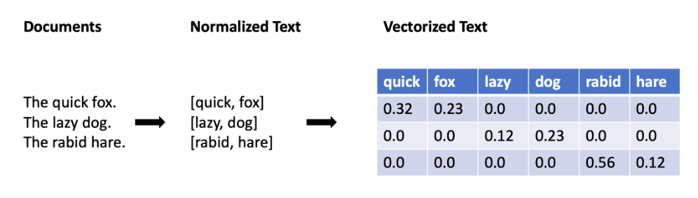

# Introduction to Machine Learning

1. [What is Machine Learning](#what-is-machine-learning)
2. [Application of Machine Learning](#application-of-machine-learning)
3. [The Data Science Process](#the-data-science-process)
4. [Scaling Data](#scaling-data)
5. [Encoding Categorical Data](#encoding-categorical-data)
6. [Image Data](#image-data)
7. [Text Data](#text-data)
8. [Two Perspective on ML](#two-perspective-on-)

## What is Machine Learning?

Machine learning is a data science technique used to extract patterns from data, allowing computers to identify related data, and forecast future outcomes, behaviors, and trends.

One important component of machine learning is that we are taking some data and using it to make predictions or identify important relationships. 

## Application of Machine Learning 

For all application there are several techniques that are frequently used.

1. Statistical Machine Learning 
2. Deep Learning 
3. Reinforcement Learning

### Natural Language Processing

1. Summarize text
2. detect topics
3. Speech to text, translation

### Computer Vision 

1. Self driving cars
2. Object detection and identification
3. LIDAR and visible spectrum

### Anaytics 

1. Regression 
2. Classification
3. Clustering

### Decision Making 

1. Sequential Decision and recommendation

Think of these 4 applications when you come across machine learning problems.

### Examples of Machine Learning

- Automating the recognition of disease
- Recommend the next best actions for individual care plans
- Enabling personalized real-time banking experiences with chat bts
- identify next best action for the customer

## The Data Science Process

Big data has become part of the lexicon of organizations worldwide, as more and more organizations look to leverage data to drive informed business decisions. With this evolution in business decision-making, the amount of raw data collected, along with the number and diversity of data sources, is growing at an astounding rate. This data presents enormous potential.

Raw data, however, is often noisy and unreliable and may contain missing values and outliers. Using such data for modeling can produce misleading results. For the data scientist, the ability to combine large, disparate data sets into a format more appropriate for analysis is an increasingly crucial skill.

The data science process typically starts with collecting and preparing the data before moving on to training, evaluating, and deploying a model. 

Collect Data -> Prepare Data -> Train Data -> Evaluate Model -> Deploy Model

## Scaling Data

Scaling data means transforming it so that the values fit within some range or scale, such as 0–100 or 0–1. There are a number of reasons why it is a good idea to scale your data before feeding it into a machine learning algorithm.

Let's consider an example. Imagine you have an image represented as a set of RGB values ranging from 0 to 255. We can scale the range of the values from 0–255 down to a range of 0–1. This scaling process will not affect the algorithm output since every value is scaled in the same way. But it can speed up the training process, because now the algorithm only needs to handle numbers less than or equal to 1.

Two common approaches to scaling data include standardization and normalization.

### Standardization

Standardization rescales data so that it has a mean of 0 and a standard deviation of 1.

The formula for this is:

**(𝑥 − 𝜇)/𝜎**

We subtract the mean (𝜇) from each value (x) and then divide by the standard deviation (𝜎). To understand why this works, it helps to look at an example. Suppose that we have a sample that contains three data points with the following values:

50,  100,  150  

The mean of our data would be 100, while the sample standard deviation would be 50.

Let's try standardizing each of these data points. The calculations are:

(50 − 100)/50 = -50/50 = -1

(100 − 100)/50 = 0/50 = 0

(150 − 100)/50 = 50/50 = 1

Thus, our transformed data points are:

-1 ,
0 ,
1

Again, the result of the standardization is that our data distribution now has a mean of 0 and a standard deviation of 1.

### Normalization

Normalization rescales the data into the range [0, 1].

The formula for this is:
**(𝑥 −𝑥𝑚𝑖𝑛)/(𝑥𝑚𝑎𝑥 −𝑥𝑚𝑖𝑛)**

For each individual value, you subtract the minimum value (𝑥𝑚𝑖𝑛) for that input in the training dataset, and then divide by the range of the values in the training dataset. The range of the values is the difference between the maximum value (𝑥𝑚𝑎𝑥) and the minimum value (𝑥𝑚𝑖𝑛).

Let's try working through an example with those same three data points:

50, 100, 150

The minimum value (𝑥𝑚𝑖𝑛) is 50, while the maximum value (𝑥𝑚𝑎𝑥) is 150. The range of the values is 𝑥𝑚𝑎𝑥 −𝑥𝑚𝑖𝑛 = 150 − 50 = 100.

Plugging everything into the formula, we get:

(50 − 50)/100 = 0/100 = 0

(100 − 50)/100 = 50/100 = 0.5

(150 − 50)/100 = 100/100 = 1

Thus, our transformed data points are:

0, 0.5, 1

Again, the goal was to rescale our data into values ranging from 0 to 1—and as you can see, that's exactly what the formula did.

## Encoding Categorical Data

There are two common approaches for encoding categorical data: ordinal encoding and one hot encoding.

### Ordinal Encoding

In ordinal encoding, we simply convert the categorical data into integer codes ranging from 0 to (number of categories – 1).

color | Encoder
------|--------
red | 0
blue| 1
green| 2

Drawabacks:
- assumed order between categories, i.e red>green

### One Hot Encoding

One-hot encoding is a very different approach. In one-hot encoding, we transform each categorical value into a column. If there are n categorical values, n new columns are added. For example, the Color property has three categorical values: Red, Green, and Blue, so three new columns Red, Green, and Blue are added.

ID | Red | Green | Blue
---|-----|-------|-----
1233| 0 | 0 | 1
2134| 0 | 1 | 0
3213| 1 | 0 | 0

Drawback: 
- Large number of columns

## Image Data

In machine learning we always work with numbers. So how do we represent images as numbers?
- Pixels

Lots of pixels come together to form an image. 

The color of each pixel is represented with a set of values:

In grayscale images, each pixel can be represented by a single number, which typically ranges from 0 to 255. This value determines how dark the pixel appears (e.g., 0 is black, while 255 is bright white).

In colored images, each pixel can be represented by a vector of three numbers (each ranging from 0 to 255) for the three primary color channels: red, green, and blue. These three red, green, and blue (RGB) values are used together to decide the color of that pixel. For example, purple might be represented as 128, 0, 128 (a mix of moderately intense red and blue, with no green).

The number of channels required to represent the color is known as the color depth or simply depth. With an RGB image, depth = 3, because there are three channels (Red, Green, and Blue). In contrast, a grayscale image has depth = 1, because there is only one channel.

### Encoding an Image

We need to know the following three things about an image to reproduce it:

1. Horizontal position of each pixel
2. Vertical position of each pixel
3. Color of each pixel
Thus, we can fully encode an image numerically by using a vector with three dimensions. The size of the vector required for any given image would be the height * width * depth of that image.

## Text Data

Text is another example of a data type that is initially non-numerical and that must be processed before it can be fed into a machine learning algorithm. Let's have a look at some of the common tasks we might do as part of this processing.

### Normalization

Text normalization is the process of transforming a piece of text into a canonical (official) form.

One of the challenges that can come up in text analysis is that there are often multiple forms that mean the same thing. For example, the verb to be may show up as is, am, are, and so on. Or a document may contain alternative spellings of a word, such as behavior vs. behaviour. So one step that you will sometimes conduct in processing text is normalization.

**Lemmatization** is an example of normalization. 
Lemmatization is the process of reducing multiple inflections to that single dictionary form. Example-

Original word |	Lemmatized word
--------------|----------------
is | be
are | be
am | be

In many cases, you may also want to remove stop words. **Stop words** are high-frequency words that are unnecessary (or unwanted) during the analysis. For example, when you enter a query like which cookbook has the best pancake recipe into a search engine, the words which and the are far less relevant than cookbook, pancake, and recipe. In this context, we might want to consider which and the to be stop words and remove them prior to analysis. Example:

Original text | Normalized text
--------------|----------------
The quick fox. | [quick, fox]
The lazzy dog. | [lazy, dog]
The rabid hare. | [rabid, hare]

Here we have **tokenized** the text (i.e., split each string of text into a list of smaller parts or tokens), removed stop words (the), and standardized spelling (changing lazzy to lazy).

### Vectorization

The goal here is to identify the particular features of the text that will be relevant to us for the particular task we want to perform—and then get those features extracted in a numerical form that is accessible to the machine learning algorithm. Typically this is done by text vectorization—that is, by turning a piece of text into a vector. Remember, a vector is simply an array of numbers—so there are many different ways that we can vectorize a word or a sentence, depending on how we want to use it. Common approaches include:

- Term Frequency-Inverse Document Frequency (TF-IDF) vectorization
- Word embedding, as done with Word2vec or Global Vectors (GloVe)

The approach of TF-IDF is to give less importance to words that contain less information and are common in documents, such as "the" and "this"—and to give higher importance to words that contain relevant information and appear less frequently. Thus TF-IDF assigns weights to words that signify their relevance in the documents.

quick | fox | lazy | dog | rabid | hare | the
------|-----|------|-----|-------|------|-----
0.32 | 0.23 | 0.12 | 0.23 | 0.56 | 0.12 | 0.0

Each chunk of text gets a vector (represented here as a row in the table) that is the length of the total number of words that we are interested in (in this case, six words). If the normalized text does not have the word in question, then the value in that position is 0, whereas if it does have the word in question, it gets assigned to the importance of the word.

### Feature Extraction

As we talked about earlier, the text in the example can be represented by vectors with length 6 since there are 6 words total.

[quick, fox] as (0.32, 0.23, 0.0, 0.0, 0.0, 0.0)

[lazy, dog] as (0.0, 0.0, 0.12, 0.23, 0.0, 0.0)

[rabid, hare] as (0.0, 0.0, 0.0 , 0.0, 0.56, 0.12)

We understand the text because each word has a meaning. But how do algorithms understand the text using the vectors, in other words, how do algorithms extract features from the vectors?

Vectors with length n can be visualized as a line in an n dimension space. For example, a vector (1,1) can be viewed as a line starting from (0, 0) and ending at (1,1).

Any vector with the same length can be visualized in the same space. How close one vector is to another can be calculated as vector distance. If two vectors are close to each other, we can say the text represented by the two vectors have a similar meaning or have some connections. For example, if we add [lazy, fox] to our example:

words-> | quick | fox | lazy | dog | rabid | hare
--------|-------|-----|------|-----|-------|------
[quick, fox] | 0.32 | 0.23 | 0.0 | 0.0 | 0.0 | 0.0
[lazy, dog] | 0.0 | 0.0 | 0.12 | 0.23 | 0.0 | 0.0
[rabid, hare] | 0.0 | 0.0 | 0.0 | 0.0 | 0.56 | 0.12
[lazy, fox] | 0.0 | 0.23 | 0.12 | 0.0 | 0.0 | 0.0

Apparently, [lazy, fox] is more similar to [lazy, dog] than [rabid, hare], so the vector distance of [lazy, fox] and [lazy, dog] is smaller than that to [lazy, fox] and [rabid, hare].

In summary, a typical pipeline for text data begins by pre-processing or normalizing the text. This step typically includes tasks such as breaking the text into sentence and word tokens, standardizing the spelling of words, and removing overly common words (called stop words).

The next step is feature extraction and vectorization, which creates a numeric representation of the documents. Common approaches include TF-IDF vectorization, Word2vec, and Global Vectors (GloVe).

Last, we will feed the vectorized document and labels into a model and start the training.

