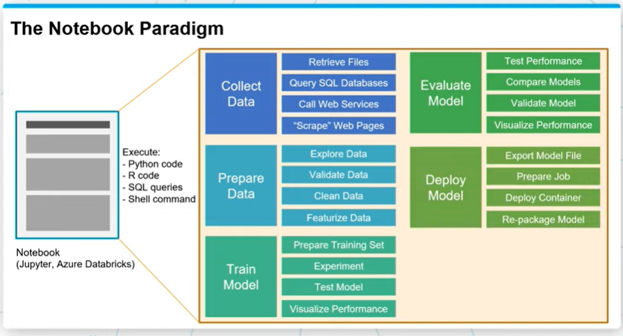

# Introduction to Machine Learning

1. [What is Machine Learning](#what-is-machine-learning)
2. [Application of Machine Learning](#application-of-machine-learning)
3. [The Data Science Process](#the-data-science-process)
4. [Scaling Data](#scaling-data)
5. [Encoding Categorical Data](#encoding-categorical-data)
6. [Image Data](#image-data)
7. [Text Data](#text-data)
8. [The Computer Science Perspective](#the-computer-science-perspective)
9. [The Statistical Perspective](#the-statistical-perspective)
10. [The Tools for Machine Learning](#the-tools-for-machine-learning)
11. [Libraries for Machine Learning](#libraries-for-machine-learning)
12. [Cloud Services for Machine Learning](#cloud-services-for-machine-learning)
13. [Models vs. Algorithms](#models-vs.-algorithms)

## What is Machine Learning?

Machine learning is a data science technique used to extract patterns from data, allowing computers to identify related data, and forecast future outcomes, behaviors, and trends.

One important component of machine learning is that we are taking some data and using it to make predictions or identify important relationships. 

## Application of Machine Learning 

For all application there are several techniques that are frequently used.

1. Statistical Machine Learning 
2. Deep Learning 
3. Reinforcement Learning

### Natural Language Processing

1. Summarize text
2. detect topics
3. Speech to text, translation

### Computer Vision 

1. Self driving cars
2. Object detection and identification
3. LIDAR and visible spectrum

### Anaytics 

1. Regression 
2. Classification
3. Clustering

### Decision Making 

1. Sequential Decision and recommendation

Think of these 4 applications when you come across machine learning problems.

### Examples of Machine Learning

- Automating the recognition of disease
- Recommend the next best actions for individual care plans
- Enabling personalized real-time banking experiences with chat bts
- identify next best action for the customer

## The Data Science Process

Big data has become part of the lexicon of organizations worldwide, as more and more organizations look to leverage data to drive informed business decisions. With this evolution in business decision-making, the amount of raw data collected, along with the number and diversity of data sources, is growing at an astounding rate. This data presents enormous potential.

Raw data, however, is often noisy and unreliable and may contain missing values and outliers. Using such data for modeling can produce misleading results. For the data scientist, the ability to combine large, disparate data sets into a format more appropriate for analysis is an increasingly crucial skill.

The data science process typically starts with collecting and preparing the data before moving on to training, evaluating, and deploying a model. 

Collect Data -> Prepare Data -> Train Data -> Evaluate Model -> Deploy Model

## Scaling Data

Scaling data means transforming it so that the values fit within some range or scale, such as 0–100 or 0–1. There are a number of reasons why it is a good idea to scale your data before feeding it into a machine learning algorithm.

Let's consider an example. Imagine you have an image represented as a set of RGB values ranging from 0 to 255. We can scale the range of the values from 0–255 down to a range of 0–1. This scaling process will not affect the algorithm output since every value is scaled in the same way. But it can speed up the training process, because now the algorithm only needs to handle numbers less than or equal to 1.

Two common approaches to scaling data include standardization and normalization.

### Standardization

Standardization rescales data so that it has a mean of 0 and a standard deviation of 1.

The formula for this is:

**(𝑥 − 𝜇)/𝜎**

We subtract the mean (𝜇) from each value (x) and then divide by the standard deviation (𝜎). To understand why this works, it helps to look at an example. Suppose that we have a sample that contains three data points with the following values:

50,  100,  150  

The mean of our data would be 100, while the sample standard deviation would be 50.

Let's try standardizing each of these data points. The calculations are:

(50 − 100)/50 = -50/50 = -1

(100 − 100)/50 = 0/50 = 0

(150 − 100)/50 = 50/50 = 1

Thus, our transformed data points are:

-1 ,
0 ,
1

Again, the result of the standardization is that our data distribution now has a mean of 0 and a standard deviation of 1.

### Normalization

Normalization rescales the data into the range [0, 1].

The formula for this is:
**(𝑥 −𝑥𝑚𝑖𝑛)/(𝑥𝑚𝑎𝑥 −𝑥𝑚𝑖𝑛)**

For each individual value, you subtract the minimum value (𝑥𝑚𝑖𝑛) for that input in the training dataset, and then divide by the range of the values in the training dataset. The range of the values is the difference between the maximum value (𝑥𝑚𝑎𝑥) and the minimum value (𝑥𝑚𝑖𝑛).

Let's try working through an example with those same three data points:

50, 100, 150

The minimum value (𝑥𝑚𝑖𝑛) is 50, while the maximum value (𝑥𝑚𝑎𝑥) is 150. The range of the values is 𝑥𝑚𝑎𝑥 −𝑥𝑚𝑖𝑛 = 150 − 50 = 100.

Plugging everything into the formula, we get:

(50 − 50)/100 = 0/100 = 0

(100 − 50)/100 = 50/100 = 0.5

(150 − 50)/100 = 100/100 = 1

Thus, our transformed data points are:

0, 0.5, 1

Again, the goal was to rescale our data into values ranging from 0 to 1—and as you can see, that's exactly what the formula did.

## Encoding Categorical Data

There are two common approaches for encoding categorical data: ordinal encoding and one hot encoding.

### Ordinal Encoding

In ordinal encoding, we simply convert the categorical data into integer codes ranging from 0 to (number of categories – 1).

color | Encoder
------|--------
red | 0
blue| 1
green| 2

Drawabacks:
- assumed order between categories, i.e red>green

### One Hot Encoding

One-hot encoding is a very different approach. In one-hot encoding, we transform each categorical value into a column. If there are n categorical values, n new columns are added. For example, the Color property has three categorical values: Red, Green, and Blue, so three new columns Red, Green, and Blue are added.

ID | Red | Green | Blue
---|-----|-------|-----
1233| 0 | 0 | 1
2134| 0 | 1 | 0
3213| 1 | 0 | 0

Drawback: 
- Large number of columns

## Image Data

In machine learning we always work with numbers. So how do we represent images as numbers?
- Pixels

Lots of pixels come together to form an image. 

The color of each pixel is represented with a set of values:

In grayscale images, each pixel can be represented by a single number, which typically ranges from 0 to 255. This value determines how dark the pixel appears (e.g., 0 is black, while 255 is bright white).

In colored images, each pixel can be represented by a vector of three numbers (each ranging from 0 to 255) for the three primary color channels: red, green, and blue. These three red, green, and blue (RGB) values are used together to decide the color of that pixel. For example, purple might be represented as 128, 0, 128 (a mix of moderately intense red and blue, with no green).

The number of channels required to represent the color is known as the color depth or simply depth. With an RGB image, depth = 3, because there are three channels (Red, Green, and Blue). In contrast, a grayscale image has depth = 1, because there is only one channel.

### Encoding an Image

We need to know the following three things about an image to reproduce it:

1. Horizontal position of each pixel
2. Vertical position of each pixel
3. Color of each pixel
Thus, we can fully encode an image numerically by using a vector with three dimensions. The size of the vector required for any given image would be the height * width * depth of that image.

## Text Data

Text is another example of a data type that is initially non-numerical and that must be processed before it can be fed into a machine learning algorithm. Let's have a look at some of the common tasks we might do as part of this processing.

### Normalization

Text normalization is the process of transforming a piece of text into a canonical (official) form.

One of the challenges that can come up in text analysis is that there are often multiple forms that mean the same thing. For example, the verb to be may show up as is, am, are, and so on. Or a document may contain alternative spellings of a word, such as behavior vs. behaviour. So one step that you will sometimes conduct in processing text is normalization.

**Lemmatization** is an example of normalization. 
Lemmatization is the process of reducing multiple inflections to that single dictionary form. Example-

Original word |	Lemmatized word
--------------|----------------
is | be
are | be
am | be

In many cases, you may also want to remove stop words. **Stop words** are high-frequency words that are unnecessary (or unwanted) during the analysis. For example, when you enter a query like which cookbook has the best pancake recipe into a search engine, the words which and the are far less relevant than cookbook, pancake, and recipe. In this context, we might want to consider which and the to be stop words and remove them prior to analysis. Example:

Original text | Normalized text
--------------|----------------
The quick fox. | [quick, fox]
The lazzy dog. | [lazy, dog]
The rabid hare. | [rabid, hare]

Here we have **tokenized** the text (i.e., split each string of text into a list of smaller parts or tokens), removed stop words (the), and standardized spelling (changing lazzy to lazy).

### Vectorization

The goal here is to identify the particular features of the text that will be relevant to us for the particular task we want to perform—and then get those features extracted in a numerical form that is accessible to the machine learning algorithm. Typically this is done by text vectorization—that is, by turning a piece of text into a vector. Remember, a vector is simply an array of numbers—so there are many different ways that we can vectorize a word or a sentence, depending on how we want to use it. Common approaches include:

- Term Frequency-Inverse Document Frequency (TF-IDF) vectorization
- Word embedding, as done with Word2vec or Global Vectors (GloVe)

The approach of TF-IDF is to give less importance to words that contain less information and are common in documents, such as "the" and "this"—and to give higher importance to words that contain relevant information and appear less frequently. Thus TF-IDF assigns weights to words that signify their relevance in the documents.

quick | fox | lazy | dog | rabid | hare | the
------|-----|------|-----|-------|------|-----
0.32 | 0.23 | 0.12 | 0.23 | 0.56 | 0.12 | 0.0

Each chunk of text gets a vector (represented here as a row in the table) that is the length of the total number of words that we are interested in (in this case, six words). If the normalized text does not have the word in question, then the value in that position is 0, whereas if it does have the word in question, it gets assigned to the importance of the word.

### Feature Extraction

As we talked about earlier, the text in the example can be represented by vectors with length 6 since there are 6 words total.

[quick, fox] as (0.32, 0.23, 0.0, 0.0, 0.0, 0.0)

[lazy, dog] as (0.0, 0.0, 0.12, 0.23, 0.0, 0.0)

[rabid, hare] as (0.0, 0.0, 0.0 , 0.0, 0.56, 0.12)

We understand the text because each word has a meaning. But how do algorithms understand the text using the vectors, in other words, how do algorithms extract features from the vectors?

Vectors with length n can be visualized as a line in an n dimension space. For example, a vector (1,1) can be viewed as a line starting from (0, 0) and ending at (1,1).

Any vector with the same length can be visualized in the same space. How close one vector is to another can be calculated as vector distance. If two vectors are close to each other, we can say the text represented by the two vectors have a similar meaning or have some connections. For example, if we add [lazy, fox] to our example:

words-> | quick | fox | lazy | dog | rabid | hare
--------|-------|-----|------|-----|-------|------
[quick, fox] | 0.32 | 0.23 | 0.0 | 0.0 | 0.0 | 0.0
[lazy, dog] | 0.0 | 0.0 | 0.12 | 0.23 | 0.0 | 0.0
[rabid, hare] | 0.0 | 0.0 | 0.0 | 0.0 | 0.56 | 0.12
[lazy, fox] | 0.0 | 0.23 | 0.12 | 0.0 | 0.0 | 0.0

Apparently, [lazy, fox] is more similar to [lazy, dog] than [rabid, hare], so the vector distance of [lazy, fox] and [lazy, dog] is smaller than that to [lazy, fox] and [rabid, hare].

In summary, a typical pipeline for text data begins by pre-processing or normalizing the text. This step typically includes tasks such as breaking the text into sentence and word tokens, standardizing the spelling of words, and removing overly common words (called stop words).

The next step is feature extraction and vectorization, which creates a numeric representation of the documents. Common approaches include TF-IDF vectorization, Word2vec, and Global Vectors (GloVe).

Last, we will feed the vectorized document and labels into a model and start the training.

## The Computer Science Perspective

**Output = Program(intput features)**

SKU | Make | Color | Quantity | Price
----|------|-------|----------|------
908721 | Guess | Blue | 789 | 45.33
456552 | Tillys | Red | 244 | 22.91
789921 | A&F | Green | 387 | 25.92
872266 | Guess | Blue | 154 | 17.56

Remember that in a typical case of machine learning, you have some kind of input which you feed into the machine learning algorithm, and the algorithm produces some output. In most cases, there are multiple pieces of data being used as input. For example, we can think of a single row from the above table as a vector of data points:

(908721, Guess, Blue, 789, 45.33)

 in computer science terminology, each element of the input vector (such as Guess or Blue) is referred to as an attribute or feature. Thus, we might feed these input features into our machine learning program and the program would then generate some kind of desired output (such as a prediction about how well the product will sell). This can be represented as:

 Output = Program(Input Features)

 ## The Statistical Perspective

 **Output Variable = f(Input Variables)**
**=> Dependent Variable = f(Independent Variables)**
**=> Y = f(x)**

In the case of multiple input variables, X would be an input vector, meaning that it would be composed of multiple individual inputs (e.g. (908721, Guess, Blue, 789, 45.33)). When this is the case, you'll see the individual inputs denoted with a subscript, as in X1, X2, X3, and so on.

In statistics, you'll also see the data described in terms of independent variables and dependent variables. These names come from the idea that the value of one variable may depend on the value of some other variables. For example, the selling price of a house is the dependent variable that depends on some independent variables—like the house's location and size.

SKU | Make | Color | Quantity | Price
----|------|-------|----------|------
908721 | Guess | Blue | 789 | 45.33
456552 | Tillys | Red | 244 | 22.91
789921 | A&F | Green | 387 | 25.92
872266 | Guess | Blue | 154 | 17.56

We might use data in each row (e.g. (908721, Guess, Blue, 789, 45.33)) to predict the sale of the corresponding item. Thus, the sale of each item is dependent on the data in each row. We can call the data in each row the independent variables and call the sale the dependent variable.

## The Tools for Machine Learning

A typical machine learning ecosystem is made up of three main components:

#### 1. Libraries:
 When you're working on a machine learning project, you likely will not want to write all of the necessary code yourself—instead, you'll want to make use of code that has already been created and refined. That's where libraries come in. A library is a collection of pre-written (and compiled) code that you can make use of in your own project. NumPy is an example of a library popularly used in data science, while TensorFlow is a library specifically designed for machine learning. 

#### 2. Development environments:
A development environment is a software application (or sometimes a group of applications) that provide a whole suite of tools designed to help you (as the developer or machine learning engineer) build out your projects. Jupyter Notebooks and Visual Studio are examples of development environments that are popular for coding many different types of projects, including machine learning projects.

#### 3. Cloud services:
 A cloud service is a service that offers data storage or computing power over the Internet. In the context of machine learning, you can use a cloud service to access a server that is likely far more powerful than your own machine, or that comes equipped with machine learning models that are ready for you to use.

For each of these components, there are multiple options you can choose from. Let's have a look at some examples.

##### Notebooks
Notebooks are originally created as a documenting tool that others can use to reproduce experiments. Notebooks typically contain a combination of runnable code, output, formatted text, and visualizations. One of the most popular open-source notebooks used today by data scientists and data science engineers is Jupyter notebook, which can combine code, formatted text (markdown) and visualization.

Notebooks contains several independent cells that allow for the execution of code snippets within those cells. The output of each cell can be saved in the notebook and viewed by others.

##### End-to-end with Azure
You can analyze and train a small amount of data with your local machine using Jupyter notebook, Visual studio, or other tools. But with very large amounts of data, or you need a faster processor, it's a better idea to train and test the model remotely using cloud services such as Microsoft Azure. You can use Azure Data Science Virtual Machine, Azure Databricks, Azure Machine Learning Compute, or SQL server ML services to train and test models and use Azure Kubernetes to deploy models.

## Libraries for Machine Learning

### Core Framework and Tools

##### Python
 Python is a very popular high-level programming language that is great for data science. Its ease of use and wide support within popular machine learning platforms, coupled with a large catalog of ML libraries, has made it a leader in this space.

##### [Pandas](https://pandas.pydata.org/)
 Pandas is an open-source Python library designed for analyzing and manipulating data. It is particularly good for working with tabular data and time-series data.

##### [NumPy](https://numpy.org/)
 Like Pandas, NumPy is a Python library. NumPy provides support for large, multi-dimensional arrays of data, and has many high-level mathematical functions that can be used to perform operations on these arrays.

### Machine Learning and Deep Learning

##### [Scikit-Learn](https://scikit-learn.org/stable/)
It is a Python library designed specifically for machine learning. It is designed to be integrated with other scientific and data-analysis libraries, such as NumPy, SciPy, and matplotlib (described below).

##### [Apache Spark](https://spark.apache.org/)
 It is an open-source analytics engine that is designed for cluster-computing and that is often used for large-scale data processing and big data.

##### [TensorFlow](https://www.tensorflow.org/)
 TensorFlow is a free, open-source software library for machine learning built by Google Brain.

##### [Keras](https://keras.io/)
It  is a Python deep-learning library. It provide an Application Programming Interface (API) that can be used to interface with other libraries, such as TensorFlow, in order to program neural networks. Keras is designed for rapid development and experimentation.

##### [PyTorch](https://pytorch.org/)
PyTorch is an open source library for machine learning, developed in large part by Facebook's AI Research lab. It is known for being comparatively easy to use, especially for developers already familiar with Python and a Pythonic code style.

### Data Visualization

##### [Plotly](https://plotly.com/)
It is not itself a library, but rather a company that provides a number of different front-end tools for machine learning and data science—including an open source graphing library for Python.

##### [Matplotlib](https://matplotlib.org/)
It is a Python library designed for plotting 2D visualizations. It can be used to produce graphs and other figures that are high quality and usable in professional publications. You'll see that the Matplotlib library is used by a number of other libraries and tools, such as SciKit Learn (above) and Seaborn (below). You can easily import Matplotlib for use in a Python script or to create visualizations within a Jupyter Notebook.

##### [Seaborn](https://seaborn.pydata.org/)
Seaborn is a Python library designed specifically for data visualization. It is based on matplotlib, but provides a more high-level interface and has additional features for making visualizations more attractive and informative.

##### [Bokeh](https://bokeh.org/)
It is an interactive data visualization library. In contrast to a library like matplotlib that generates a static image as its output, Bokeh generates visualizations in HTML and JavaScript. This allows for web-based visualizations that can have interactive features.

## Cloud Services for Machine Learning

A typical cloud service for machine learning provides support for managing the core assets involved in machine learning projects. 

Feature | Description
--------|------------
Datasets | Define, version, and monitor datasets used in machine learning runs.
Experiments/Runs | Organize machine learning workloads and keep track of each task executed through the service.
Pipelines | Structured flows of tasks to model complex machine learning flows.
Models | Model registry with support for versioning and deployment to production.
Endpoints | Expose real-time endpoints for scoring as well as pipelines for advanced automation.

Machine learning cloud services also need to provide support for managing the resources required for running machine learning tasks:

Feature | Description
--------|------------
Compute | Manage compute resources used by machine learning tasks.
Environments | Templates for standardized environments used to create compute resources.
Datastore | Data sources connected to the service environment (e.g. blob stores, file shares, Data Lake stores, databases).

### Azure ML workspace

Following are some of the features in Azure ML workspace, a centralized place to work with all the artifacts you create:

Feature | Description
--------|------------
Automated ML | Automate intensive tasks that rapidly iterate over many combinations of algorithms, hyperparameters to find the best model based on the chosen metric.
Designer | A drag-and-drop tool that lets you create ML models without a single line of code.
Datasets | A place you can create datasets.
Experiments	A place that helps you organize your runs.
Models | A place to save all the models created in Azure ML or trained outside of Azure ML.
Endpoints | A place stores real-time endpoints for scoring and pipeline endpoints for advanced automation.
Compute | A designated compute resource where you run the training script or host the service deployment.
Datastores | An attached storage account in which you can store datasets.

## Models vs. Algorithms

In machine learning, the key distinction of a model and an algorithm is:

Models are the specific representations learned from data

Algorithms are the processes of learning

We can think of the algorithm as a function—we give the algorithm data and it produces a model:

**Model = Algorithm(Data)Model=Algorithm(Data)**

### Machine Learning Algorithms
We can think of an algorithm as a mathematical tool that can usually be represented by an equation as well as implemented in code. For example, y = Wx + b is an algorithm that can be used to calculate y from x if the values for W and b are known. But how do we get W and b?

This is the learning part of machine learning; That is, we can learn these values from training data. For example, suppose the following data are collected:

x | y
--|--
1 | 1
2 | 2
3 | 3

We can plug the data into the algorithm and calculate W = 1 and b = 0. We would say that that the algorithm was run on the data and learned the values ofr W and b. The output of the learning process is W = 1 and b = 0.

### Machine Learning Models

Machine learning models are outputs or specific representations of algorithms that run on data. A model represents what is learned by a machine learning algorithm on the data.

In the previous example, y = 1*x + 0 is the model we obtained from running the algorithm y = Wx + b on the training data. We can also say that y = 1*x + 0 is the model that can be used to predict y from x.

A machine learning model can also be written in a set of weights or coefficients instead of a full equation. Looking at the previous example, since we know the algorithm, it is redundant to keep the full equation y = 1*x + 0. All we need are the weights (or coefficients) W = 1 and b = 0. Thus, we can also think of a model as a set of weights (or coefficients) that have been learned.